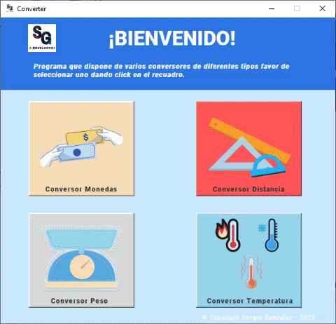
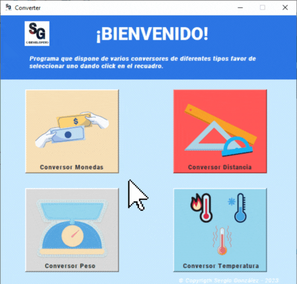
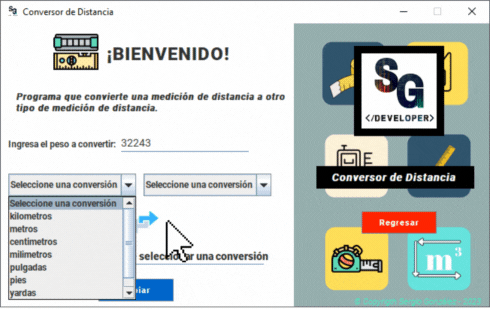
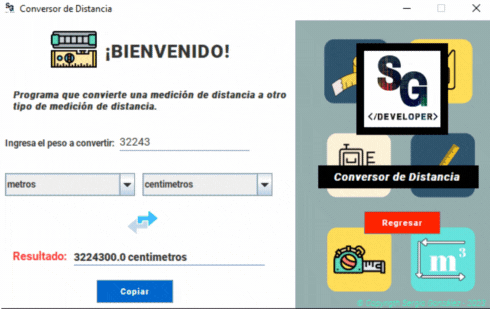
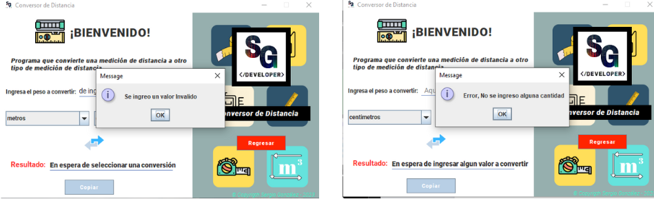
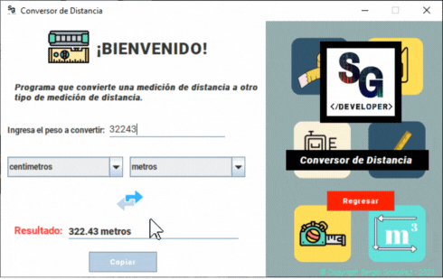
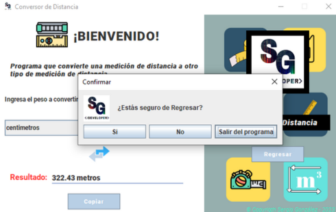

<h1 align="center">
 CHALLENGE ALURA: CONVERTER 

</h1>

## Introduccion

El proyecto <strong>Converter</strong> fue creado para cumplir con un desafío impuesto por las empresas Alura y Oracle. El objetivo del desafío era crear un conversor de monedas con Java Swing. En este proyecto se crearon cuatro conversores: <strong>un conversor de monedas o divisas, un conversor de peso, un conversor de distancia y un conversor de temperatura</strong>. Cada uno de los conversores fue creado con una interfaz intuitiva para el usuario y con un diseño bonito.

## Descripción del proyecto

La aplicación de escritorio <strong>Converter</strong> es una herramienta que contiene cuatro programas en uno. Cada uno de los programas realiza una conversión diferente: conversión de monedas o divisas, conversión de peso, conversión de distancia y conversión de temperatura.

El conversor de monedas utiliza una API llamada <em>currencyfreaks.api</em> para extraer los valores de las monedas de todo el mundo al momento. El conversor de unidades de peso y distancia utilizan la misma lógica, utilizando un <em>HashMap</em> de la librería util de Java, en el cual se creó un diccionario de datos con los valores de cada una de las unidades a convertir específicas. Por último, el conversor de temperatura funciona con métodos donde están las fórmulas de cada una de las conversiones.

## Estado del proyecto

La aplicación de escritorio <strong>Converter</strong> está en funcionamiento, pero se encuentra en espera de actualizaciones. Se está trabajando en mejorar el código para lanzar nuevas versiones 👨🏼‍💻👨🏼‍🔧. La API utilizada para extraer los valores de las monedas de todo el mundo al momento se llama <em>currencyfreaks.api</em>. Desafortunadamente, esta API tiene una licencia gratuita que restringe muchos servicios. Por ejemplo, solo te otorga 1000 llamadas a la API y actualiza las monedas cada 12 horas ⚠️. Esto significa que va retrasado por 12 horas en la actualización de las monedas. Además, solo te otorga las consultas como moneda base los USD, por lo que se tuvo que implementar diferentes algoritmos para que te retorne los cambios de monedas especificados en el desafío. Esto afecta el performance del proyecto 😔.

## Características de la aplicación y demostración
<strong>Converter</strong> cuenta con 7 interfaces que tienen un diseño amigable con el usuario, con indicaciones claras y concisas, flexibles y atractivas para el usuario. Estas interfaces las puedes utilizar para navegar dentro de la aplicación la cual te brinda 4 distintos tipos de conversores.

Al entrar al programa verás las siguientes Interfaces:

1) *ref* **Interfaz Principal**

La interfaz principal de **Converter** muestra cuatro recuadros que contienen los cuatro conversores que contiene el programa. Para empezar a hacer conversiones, el usuario debe hacer clic en el recuadro del conversor seleccionado.

2) **Interfaz Distancia** (#distancia)

En esta interfaz se muestra el conversor de distancia. Para convertir un peso, el usuario debe ingresar el peso a convertir y seleccionar la conversión deseada haciendo clic en el menú desplegable que contiene las unidades de medida de peso (kilogramos, gramos, miligramos, libras, onzas y toneladas).

Una vez seleccionada la primera unidad de medida, el usuario debe seleccionar la segunda unidad de medida en el otro menú desplegable. El resultado se mostrará inmediatamente.

Es importante mencionar que el conversor valida que el usuario haya ingresado un valor numérico para convertir. Si el usuario no ha ingresado ningún valor o si el valor ingresado no es numérico, se mostrará una alerta.

Además, se ha agregado un botón de inversión que permite cambiar las unidades dev medida de forma inversa para convertir en la dirección opuesta.

Si el usuario desea copiar el resultado de la conversión, puede hacerlo haciendo clic en el botón “Copiar”. El resultado se copiará automáticamente al portapapeles.

Por último, se ha agregado un botón de color rojo que permite al usuario regresar a la interfaz principal en caso de que desee experimentar con otros conversores. Al hacer clic en el botón, aparecerá una pantalla emergente que le pedirá al usuario que confirme si desea regresar a la interfaz principal. Si el usuario desea quedarse en el conversor actual, puede hacer clic en “No” o salir del programa.

3) **Interfaz Peso**

Esta interfaz funciona de misma forma que la [interfaz Distancia](#distancia) esta creada con la mism lógica, puedes revisar 