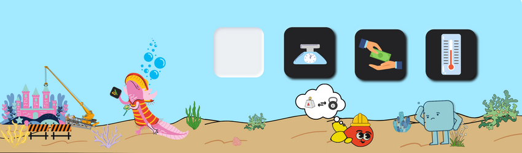

<h1 align="center">
 CHALLENGE ALURA: CONVERTER 

</h1>

## Introduccion

El proyecto <strong>Converter</strong> fue creado para cumplir con un desafío impuesto por las empresas Alura y Oracle. El objetivo del desafío era crear un conversor de monedas con Java Swing. En este proyecto se crearon cuatro conversores: <strong>un conversor de monedas o divisas, un conversor de peso, un conversor de distancia y un conversor de temperatura</strong>. Cada uno de los conversores fue creado con una interfaz intuitiva para el usuario y con un diseño bonito.

## Descripción del proyecto

La aplicación de escritorio <strong>Converter</strong> es una herramienta que contiene cuatro programas en uno. Cada uno de los programas realiza una conversión diferente: conversión de monedas o divisas, conversión de peso, conversión de distancia y conversión de temperatura.

El conversor de monedas utiliza una API llamada <em>currencyfreaks.api</em> para extraer los valores de las monedas de todo el mundo al momento. El conversor de unidades de peso y distancia utilizan la misma lógica, utilizando un <em>HashMap</em> de la librería util de Java, en el cual se creó un diccionario de datos con los valores de cada una de las unidades a convertir específicas. Por último, el conversor de temperatura funciona con métodos donde están las fórmulas de cada una de las conversiones.

## Estado del proyecto

La aplicación de escritorio <strong>Converter</strong> está en funcionamiento, pero se encuentra en espera de actualizaciones. Se está trabajando en mejorar el código para lanzar nuevas versiones. La API utilizada para extraer los valores de las monedas de todo el mundo al momento se llama <em>currencyfreaks.api</em>. Desafortunadamente, esta API tiene una licencia gratuita que restringe muchos servicios. Por ejemplo, solo te otorga 1000 llamadas a la API y actualiza las monedas cada 12 horas. Esto significa que va retrasado por 12 horas en la actualización de las monedas. Además, solo te otorga las consultas como moneda base los USD, por lo que se tuvo que implementar diferentes algoritmos para que te retorne los cambios de monedas especificados en el desafío. Esto afecta el rendimiento del proyecto 😔.
